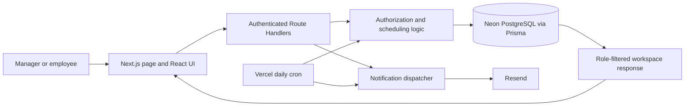

# The Schedule

A full-stack staff scheduling application for a retail store, built with Next.js, TypeScript, and PostgreSQL. It replaces an Excel-and-paper workflow with shared availability, manager-reviewed schedules, and employee coverage and swap requests.

Built around the scheduling requirements of **Men Are From Mars**, the current application serves one store. Managers can also work shifts; manager and employee are access levels, not job titles.

**Implementation scope:** manager and employee interfaces, scheduling rules, Google sign-in and invitation flows, API authorization, shared persistence, email delivery, recovery controls, and regression tests. The sections below explain the implementation and its current limits.

[Workflow](#overview-and-workflow) · [Architecture](#how-the-system-works) · [Engineering decisions](#engineering-decisions) · [Publication deep dive](#deep-dive-publishing-a-schedule) · [Run locally](#running-locally) · [Limitations](#current-limitations-and-next-improvements)

## Screenshots and demo

The authenticated application requires an approved Google account or an invitation. There is no public, anonymous scheduling sandbox in this repository.

**Screenshot placeholders:** no application screenshots are committed yet; the image in `public/` is the store logo. Capture these screens from a separate development database with fictional staff and representative schedules, then save the images under `docs/screenshots/` and embed them here.

| Screen to capture | State to show | Suggested filename |
| --- | --- | --- |
| Manager schedule builder | Sunday-start calendar with assigned shifts, an unassigned slot, and the employee assignment panel | `manager-builder.png` |
| Publication review | A completed draft, readiness checks, hours summary, and notification recipient count | `publish-review.png` |
| Employee mobile view | Published upcoming shifts and bottom navigation at a phone-sized viewport | `employee-mobile.png` |
| Hours report | Selected published period with initial versus final hours after a coverage change or worked-shift correction | `hours-report.png` |

Keep names and emails fictional, omit invitation tokens, and capture the working application rather than mockups. For a short walkthrough: submit availability, generate and complete a draft, review publication, then show the employee's published shifts.

## Overview and workflow

Store scheduling involves more than assigning names to a calendar: employees have different unavailable times, a published assignment may change, and managers need to distinguish the original plan from who ultimately worked. This project brings those steps into one shared workflow.

1. A manager invites employees by email; each accepts using the matching Google account.
2. Employees submit full-day, shift-specific, or custom-time unavailability, or explicitly report no unavailable days.
3. The manager reviews submissions, generates shifts from store templates, and assigns staff manually or with auto-complete.
4. The manager resolves blocking issues, reviews the schedule, and publishes it. Each active member receives one consolidated schedule email when delivery is configured.
5. Employees view published shifts, offer coverage, and request swaps. Managers approve assignment changes and review hours for current or retained published periods.

## Key features

- **Scheduling with constraints:** availability-aware assignments, one shift per employee per day, editable shift times, explicit manual cover, and publication checks repeated on the server.
- **Role-specific access:** employees manage their own availability and requests; managers handle invitations, schedules, approvals, reports, and recovery. Managers have a personal employee view without impersonating coworkers.
- **Shared workspace:** debounced saves, background refresh, and version checks prevent an old browser snapshot from silently replacing newer work.
- **Published schedule continuity:** employees can keep using a published schedule while the manager prepares the next semi-monthly period. Coverage history and original assignments remain available for reporting.
- **Operations and recovery:** scheduled availability reminders, delivery logs, a checksum-verified workspace backup, and guarded restore with stale-tab invalidation.
- **Employee mobile interface:** compact dashboard, touch-sized actions, bottom navigation, and a vertical team agenda. Manager tools use a desktop-oriented layout.

## Tech stack

| Area | Technologies used |
| --- | --- |
| Frontend | Next.js 15 App Router, React 19, TypeScript, Tailwind CSS 3, Lucide icons |
| Backend | Next.js Route Handlers, shared TypeScript business rules |
| Authentication | NextAuth.js 4 / Auth.js, Google OAuth, Prisma adapter, database sessions |
| Persistence | PostgreSQL hosted on Neon, Prisma 6, versioned SQL migrations |
| Hosting and scheduled work | Vercel; daily cron declared in `vercel.json` |
| Email | Resend; Google is the identity provider, not the email-sending API |
| Tests and tooling | Node's `node:test` and `assert`, `tsx`, ESLint, TypeScript strict mode, npm lockfile |

Versions above describe the major versions in [package.json](./package.json); [package-lock.json](./package-lock.json) records resolved dependencies.

## How the system works

The application is one Next.js project. The server-rendered entry page checks identity and store membership before rendering the interactive React application. Most workflow UI and local state live in [`the-schedule-app.tsx`](./src/components/the-schedule-app.tsx).



For an ordinary edit, React updates local state and sends a snapshot to `PUT /api/test-state` after a 200 ms debounce. Saves from the same browser are serialized. The route resolves the authenticated store, filters employee changes, and performs a conditional database update using the expected version and run ID. Successful responses contain the new version; employee responses are filtered again before leaving the server.

Visible manager sessions refresh every five seconds and employee sessions every fifteen seconds, with another refresh on tab return. Refresh avoids overwriting pending local work. A conflicting save pauses persistence and offers download/reload recovery. Workspace data is not persisted in browser storage as an offline fallback; the client clears legacy workspace caches. Theme preference also has a local browser value.

Publication, invitations, backups, and schedule progression have dedicated routes because they involve additional validation or side effects. Some names retain the project's prototype history: `/api/test-state` is the current authenticated persistence API, and `demo-data.ts` contains business rules as well as fixtures.

### Project map

| Location | Responsibility |
| --- | --- |
| [`src/app/page.tsx`](./src/app/page.tsx), [`src/lib/auth.ts`](./src/lib/auth.ts), [`src/lib/access.ts`](./src/lib/access.ts) | Entry-point access checks, OAuth configuration, active membership resolution |
| [`src/components/`](./src/components/) | Sign-in screen and main manager/employee application |
| [`src/app/api/`](./src/app/api/) | Workspace, publication, invitation, notification, backup, and UAT endpoints |
| [`src/lib/workspace-state.ts`](./src/lib/workspace-state.ts), [`test-state-shared.ts`](./src/lib/test-state-shared.ts) | Persistence, concurrency checks, employee filtering, shared workspace contract |
| [`src/lib/demo-data.ts`](./src/lib/demo-data.ts), [`schedule-builder.ts`](./src/lib/schedule-builder.ts) | Availability semantics, shift generation, hours calculations, auto-assignment, publication blockers |
| [`src/lib/schedule-progression.ts`](./src/lib/schedule-progression.ts), [`schedule-lifecycle.ts`](./src/lib/schedule-lifecycle.ts) | Period boundaries, retained publications, real-clock rollover and simulated UAT progression |
| [`src/lib/schedule-rollout.ts`](./src/lib/schedule-rollout.ts), [`schedule-notifications.ts`](./src/lib/schedule-notifications.ts) | Pure notification planning and database/provider orchestration |
| [`src/lib/workspace-backup.ts`](./src/lib/workspace-backup.ts) | Canonical JSON fingerprints, bounded backup storage, restore |
| [`prisma/`](./prisma/), [`tests/`](./tests/), [`docs/`](./docs/) | Schema/migrations/seed, regression suite, user and operations guides |

## Backend and data model

### What is actually persisted

The database combines relational identity/operations tables with a JSON scheduling workspace. **The normalized scheduling schema exists, but the interactive scheduling workflow does not primarily write individual `Shift` or `AvailabilitySubmission` rows.**

| Data | Current persistence role |
| --- | --- |
| `User`, `Account`, `Session` | Google account links and database-backed sessions |
| `Store`, `StoreMembership` | Store ownership of data and per-store access role; membership is unique per store/user pair |
| `StoreInvitation` | Expiring invitation token, invited email, acceptance and sender information |
| `StoreWorkspaceState` | One JSON document and integer version per store: people, period, shifts, availability, coverage, swaps, preferences, history, and UAT records |
| `StoreWorkspaceBackup` | One overwritten workspace snapshot per store with checksum, source revision, and restore metadata |
| `NotificationLog`, `AuditLog` | Relational delivery claims/results and selected server-side audit events; the workspace also contains UI notification/audit entries |
| `SchedulePeriod`, `Shift`, `AvailabilitySubmission`, `UnavailableDay`, `CoverageRequest`, `SwapRequest`, `ShiftSnapshot` | Normalized domain model and seed data; a foundation for migrating the JSON workflows |

In the relational model, a store has memberships and schedule periods; a period has shifts and availability submissions; a submission has unavailable entries; coverage and swaps reference shifts. The workspace mirrors much of that domain using IDs in JSON, so database foreign keys do not enforce those internal workspace references. See the [Prisma schema](./prisma/schema.prisma).

### Authentication and authorization

Google sign-in is allowed for an active user with an active membership, or an unexpired pending invitation. Invitation acceptance checks the token and signed-in email before activating membership. Invitations expire after 14 days; resending rotates the token and expiry.

[`getCurrentAccess`](./src/lib/access.ts) checks the current database user and membership on each protected request. Without an explicit store, it selects the first active membership; there is no store-switching interface. Employees are bound to their signed-in profile. Workspace responses exclude draft shifts, coworker emails and availability, and manager-only records. Employee writes preserve manager-owned fields and allow specific request transitions rather than accepting the submitted snapshot wholesale.

The dedicated publication route requires a manager and validates scheduling blockers server-side. The general manager workspace write path is broader and does not independently enforce every UI business rule; this is a current hardening boundary, not a guarantee of comprehensive server validation.

### Important endpoints

| Endpoint | Purpose |
| --- | --- |
| `GET / PUT /api/test-state` | Read or save the authenticated store workspace with version/run checks and employee filtering |
| `POST /api/schedule/publish` | Validate and persist publication, preserve original assignments/times, dispatch schedule emails |
| `POST / PATCH / PUT /api/invites` | Create, correct, or resend pending employee invitations; manager-only |
| `GET /api/invites/accept` | Complete an invitation using the matching Google identity |
| `GET / POST / PUT /api/backups/workspace` | Inspect, create, or restore the workspace backup; manager-only |
| `GET /api/cron/schedule-rollout` | Bearer-secret-protected daily rollover, backup, and reminder processing |
| `POST /api/notifications/test-email` | Send workflow/test notifications with role/type restrictions and draft-shift suppression |

The daily job is scheduled at 16:00 UTC. Reminder dates use `America/Edmonton` calendar days and can catch up from three days before release through the availability deadline. Automatic rollover opens the next draft only after the current period is published; it does not assign or publish shifts.

The Reports UI exports the selected workspace period in the browser. The separate `GET /api/reports/hours` route still exports fixture data and should not be used as a live reporting API. Detailed route contracts are in the [API reference](./docs/API_REFERENCE.md).

## Engineering decisions

The rationale below describes the practical fit and tradeoffs visible in the implementation, rather than claiming an undocumented evaluation of alternatives.

| Decision | Why it fits this project | Tradeoff | Alternative |
| --- | --- | --- | --- |
| One Next.js application with shared TypeScript rules | UI and API can use the same availability/publication logic with one deployment | The main UI still owns substantial workflow logic | Separate domain services behind focused API commands |
| Relational identity plus a JSON workspace | Stores the evolving single-store workflow as one coherent snapshot while using relational constraints for membership and notification claims | Whole-document writes, duplicated domain representations, and conflicts between unrelated edits | Normalize scheduling operations and update affected rows transactionally |
| Optimistic version checks and polling | Rejects stale writes and refreshes other devices without a persistent socket service | Conflicts require user recovery; polling repeatedly reads the workspace | Per-entity revisions and transactional commands, with push updates if needed |
| Greedy schedule auto-complete | Keeps existing assignments and fills gaps using available staff with fewer shifts, then fewer hours | Random tie-breaking and processing order affect results; it does not backtrack or guarantee an optimal schedule | Constraint programming or integer optimization for more complex staffing rules |
| One protected workspace backup | Bounds snapshot storage and supports a straightforward restore operation | No multi-version recovery history; identity and other relational tables are outside this backup | Retained snapshots plus database-level point-in-time recovery |

## Technical challenges

### 1. Preventing lost updates across devices

Two browsers can load the same version and edit different fields. Debouncing alone cannot stop the later full snapshot from overwriting the earlier save. [`writeWorkspaceState`](./src/lib/workspace-state.ts) compares store ID, version, and run ID in the same SQL update that replaces the JSON and increments the version. A zero-row update becomes a conflict.

Browser snapshots are not automatically retried. Server-owned operations may retry up to five times, recomputing their changes from the latest state. **Takeaway:** retrying a transformation can be safe where replaying a stale snapshot is not. The compromise is that even unrelated edits contend on the same store revision.

### 2. Making availability mean the same thing everywhere

A shift-template restriction should block that selected time slot, while a custom range should block any overlap. The distinction matters when Open, Mid, and Close templates overlap. [`isEmployeeUnavailable`](./src/lib/demo-data.ts) matches employee **and schedule period**, then applies full-day, exact submitted template-time, or interval-overlap rules.

Matching by period prevents older submissions from shadowing new availability. Tests cover overlapping templates, legacy template-only entries, custom ranges, and mixed-period ordering. **Takeaway:** domain-specific semantics need one shared implementation. Missing submissions currently mean no recorded conflict; managers review missing-submission indicators separately.

### 3. Opening a new period without losing the current schedule

The next draft may open while employees are still working the preceding publication. [`openDueScheduleCycle`](./src/lib/schedule-progression.ts) retains published shifts and their related availability/requests while opening a draft. Period generation alternates days 1–15 and 16–month-end, including leap February; history is capped at six publications.

Real-clock transitions preserve ongoing work, whereas explicit UAT progression resets period-specific test work. Repeated or late cron calls must not replace an unfinished draft. **Takeaway:** scheduling needs separate concepts for the period being planned and periods still being worked. Bounded history also limits long-term reporting.

### 4. Sending notifications without duplicates

Cron retries and repeated publication requests can repeat the same logical email. Reminder/publication plans use deterministic keys; a unique `NotificationLog.dedupKey` claim precedes sending, and the same key is passed to Resend. Provider results record status, provider ID, and failure reason.

However, a database write and an external email cannot form one transaction. A failed or interrupted claim is not automatically reclaimed, so duplicate prevention can leave a delivery needing manual recovery. **Takeaway:** idempotency and reliable retry are separate requirements; an outbox with a retry worker would address the remaining gap.

### 5. Recording actual work without rewriting the original plan

Coverage and later corrections can change who worked after publication. Original employee/time fields remain on the shift for comparison. [`correctWorkedShift`](./src/lib/worked-shift-correction.ts) accepts a manager, past published shift, replacement employee, and reason; it records an audit entry and closes pending requests involving that shift while preserving completed history.

Actual-work corrections intentionally bypass future-planning availability rules and send no email. **Takeaway:** historical facts and planning constraints have different purposes. These reports reflect recorded assignments/corrections, not clock-in data or a payroll system.

## Deep dive: publishing a schedule

Publication ties together UI validation, concurrency, reporting, and external delivery:

1. **Build and review.** `autoAssignDraftShifts` keeps filled slots, excludes inactive/unavailable staff and people already assigned that day, then ranks candidates by shift count, hours, and a random tie-breaker. Unfillable slots remain visible. The UI opens a publication review before submission.
2. **Submit the current revision.** The client requires pending saves to finish before posting the period, shifts, `workspaceVersion`, and `uatRunId` to [`POST /api/schedule/publish`](./src/app/api/schedule/publish/route.ts).
3. **Authorize and validate.** The route checks manager membership, requires the current period and matching shift period IDs, and calls `getScheduleBlockingIssues`. Unfilled slots, duplicate employee/day assignments, unavailable employees, and invalid time ranges block publication. A named manual cover can fill a slot without an internal employee assignment.
4. **Persist the publication.** The route sets published status/time, preserves each shift's original employee/start/end values, and saves through the atomic workspace revision check. It also writes a relational publication audit record.
5. **Plan and send.** [`buildPublishedSchedulePlans`](./src/lib/schedule-rollout.ts) intersects active memberships with active workspace people and creates one email per recipient containing their assigned shifts. The dispatcher claims each key and calls Resend. Without a key configured, email returns `queued`; this is a logged outcome, not a durable background queue.
6. **Merge delivery results.** The server appends delivery summaries using an update recomputed from the latest workspace, then returns state and delivery outcomes to the UI.

**Failure boundary:** publication is persisted before email delivery. A later audit/provider/logging failure can therefore leave the schedule published even if the overall request fails. There is no transaction spanning publication, all audit records, and email. This is the clearest place to discuss a future transactional outbox and recovery process.

## Running locally

You need Node.js and npm, an empty PostgreSQL development database (local or a separate Neon branch), and Google OAuth credentials. The repository does not pin a Node version; the documented test command was verified with Node 23.6.1. Authentication is required locally as well as in the hosted application.

### 1. Install and configure

```bash
npm ci
cp .env.example .env
```

Set the following values in `.env`; keep real credentials out of Git:

| Variable | Local configuration |
| --- | --- |
| `DATABASE_URL` | Connection string for your empty development database |
| `SEED_MANAGER_EMAIL` | Your Google account email, lowercase; used when seeding |
| `GOOGLE_CLIENT_ID`, `GOOGLE_CLIENT_SECRET` | Google OAuth web application credentials |
| `NEXTAUTH_SECRET` | A generated random secret, for example from `openssl rand -base64 32` |
| `NEXTAUTH_URL`, `NEXT_PUBLIC_APP_URL` | Both `http://localhost:3000` |
| `RESEND_API_KEY` | Leave empty to log email as queued; configure only for real delivery |
| `EMAIL_FROM`, `OWNER_ALERT_EMAIL` | Your verified sender and alert recipient when enabling delivery |
| `CRON_SECRET` | A random bearer secret if testing the cron route |

Configure the Google web client with origin `http://localhost:3000` and redirect URI `http://localhost:3000/api/auth/callback/google`. Add your sign-in account as a test user if your OAuth application is restricted to testing.

**Store-specific setup:** the seed, workspace defaults, and development fixtures still contain the original store's identities. For a portable local copy, replace those with accounts you control and fictional display names in [`prisma/seed.ts`](./prisma/seed.ts), [`default-managers.ts`](./src/lib/default-managers.ts), and [`demo-data.ts`](./src/lib/demo-data.ts) before seeding. Keep corresponding emails consistent and retain fixture IDs. `SEED_MANAGER_EMAIL` changes the relational seed manager but does not replace all workspace defaults. Also replace the example owner-alert address before enabling email.

### 2. Initialize only the development database

```bash
npm run prisma:generate
npm run prisma:deploy
npm run prisma:seed
npm run dev
```

`prisma:deploy` applies committed migrations to the empty database. Use `npm run prisma:migrate` when authoring a new migration. The seed creates the store, memberships, templates, and sample relational scheduling records; it also updates existing seed records, so do not run it against the live store.

Open [localhost:3000](http://localhost:3000) and sign in as your seeded manager. The JSON workspace starts separately as a clean upcoming period with default managers and no shifts. Managers can use development-only scenario presets to populate workflow states. Full employee invitation testing requires email delivery and a second controlled Google identity. Starting the development server does not reset a database.

### 3. Checks and production build

```bash
npm test
npm run lint
npm run typecheck
npm run build
npm start
```

Run `npm start` after the build, with the development server stopped if both use port 3000. The build generates the Prisma client; it does not apply migrations or seed data. Local `next dev` does not execute Vercel's cron schedule automatically.

### Testing scope

At this README revision, **75 automated tests pass**. The suite covers availability rules, schedule generation and publication rejection, employee read/write filtering, concurrent saves, period rollover, repeat coverage, worked-shift corrections, backup fingerprints, reset behavior, notification planning, and authentication configuration/callback handling.

Tests use Node's test runner through `tsx`; database/provider boundaries are mocked where exercised. The concurrency test uses an in-memory adapter that models the conditional update. These are regression tests, not proof of real PostgreSQL isolation behavior or complete browser authentication flows. The in-app guided journey and advanced UAT checklist cover manual manager/employee verification; checklist size is not an automated coverage metric.

See the [testing runbook](./docs/TESTING_UAT.md) for manual workflows and the [operations guide](./docs/OPERATIONS.md) for hosting, migrations, email, cron, backup, and recovery. [Launch verification](./docs/LAUNCH_VERIFICATION.md) records release checks separately from local test results.

## Current limitations and next improvements

- **Large client component and broad writes.** The main component is over 5,000 lines. Split workflow components/hooks and move state transitions into typed server commands with runtime validation. Availability deadlines and several approval rules currently rely on UI checks, and manager workspace writes accept broad snapshots.
- **Single-store assumptions and setup friction.** Store branding, default identities, fixtures, and some notification targets are hard-coded. Centralize configuration and provide a fictional demo seed before presenting this as a reusable product. Multi-store schema support is not a finished multi-store application.
- **Persistence scalability.** One JSON row creates contention and requires whole-workspace reads/writes. Move shifts, availability, and requests to normalized transactions before increasing concurrency; consider push updates after measuring polling cost.
- **Notification recovery and trust.** Add retryable outbox processing for publication/reminders. The general notification endpoint accepts client-supplied subject/HTML and does not verify a corresponding persisted action; generate content and recipients from server-owned events and add abuse controls.
- **Authentication hardening.** Sessions currently have a ten-year rolling maximum, and Google email account linking is enabled for pre-created users. Reassess session lifetime, explicitly validate provider email-verification assumptions, and add browser tests for uninvited/inactive accounts, invitations, and role changes.
- **Incomplete reporting and recovery scope.** Wire the fixture-backed hours API to the selected persisted period or remove it. Six retained publications and one workspace backup do not provide long-term reporting or full-database recovery.
- **Reproducible verification and presentation.** Commit representative screenshots, pin a runtime, add CI for existing checks, and add real-database and browser integration tests. No CI workflow or committed browser test suite is present. The remaining documentation also contains deployment-specific history that should be reviewed before sharing publicly.

## What this project demonstrates

- Translating a store workflow into a full-stack application with distinct manager and employee experiences.
- Designing scheduling rules and testing domain edge cases across draft, published, and historical data.
- Applying server-side access checks, employee data filtering, and optimistic concurrency control.
- Integrating OAuth, PostgreSQL persistence, scheduled jobs, and email with explicit failure boundaries.
- Building recovery tools and explaining where an MVP's architecture needs further hardening.

For deeper reference, start with the [documentation index](./docs/README.md), [architecture guide](./docs/ARCHITECTURE.md), or [user guide](./docs/USER_GUIDE.md).
