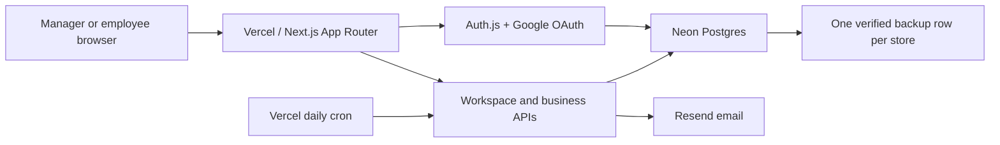
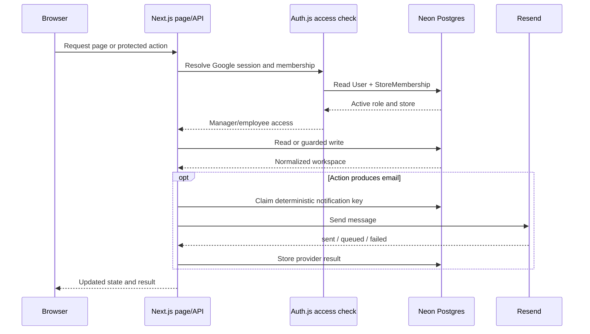
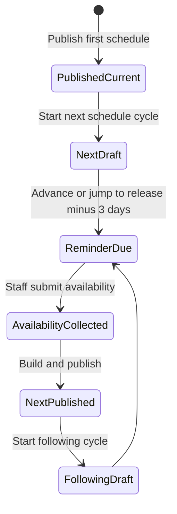

# Architecture

## Purpose and boundaries

The Schedule is a production-like UAT application for one Men Are From Mars store. It has real authentication, shared database persistence, email delivery, deployment, scheduled work, and backup recovery. Most business state remains in a JSON workspace bridge while the normalized Prisma models provide the target structure for future hardening.

The application is server-rendered at the access boundary and interactive after the authenticated user and store membership are resolved.

## Runtime components

### Web application

`src/app/page.tsx` checks the Auth.js database session on every page request. A signed-out user receives the access screen. A signed-in user without an active user and active store membership receives an access-denied state. An authorized user receives the main application with their server-resolved access record and the active member email list.

`src/components/the-schedule-app.tsx` holds the current manager and employee user experience. It loads the shared workspace from `/api/test-state`, applies interactions locally, and saves authorized changes back to Neon.

### Authentication and authorization

Google verifies the email identity. Auth.js stores OAuth accounts and sessions in Postgres. The first-login linking option is enabled because seeded and invited users exist before their first Google login.

A Google login is accepted only when the normalized email has either:

- an active `User` and active `StoreMembership`; or
- a pending, unexpired `StoreInvitation`.

The application never treats hidden navigation as authorization. Every sensitive route calls `getCurrentAccess()` and checks the membership role again. Employees are bound to the workspace person matching their signed-in email.

### Shared scheduling workspace

`StoreWorkspaceState` stores one normalized JSON document per store. It currently contains the active period, people, availability, shifts, requests, notifications, audit entries, UAT results, issues, simulated date, and bounded history.

Every workspace has a `uatRunId`. Writes from an old browser tab fail with HTTP `409` when a clean reset or restore has changed the run identifier. Every read also returns `workspaceVersion` from the database row. Every ordinary write atomically matches that version and run ID before replacing JSON and incrementing the version. Publishing and day progression enforce the same browser revision. Server notification appends recompute against the latest state and retry bounded version conflicts within the same run.

Employee responses are allowlisted before serialization: own availability, drafts, preferences and notifications; published team shifts without internal notes; relevant coverage and swaps. Coworker emails, draft schedules, audit logs, UAT issues/results, and invite acceptances are not sent. Workspace payloads are no longer written to localStorage. Legacy workspace caches are cleared on app load; failed authenticated reads never fall back to cached or fixture data.

Employee writes are reconstructed on the server. An employee may change only their own availability, personal preference, valid coverage/swap actions, their own issue reports, and associated audit/notification additions. Manager-controlled schedule fields from an employee payload are discarded.

### Normalized relational model

`prisma/schema.prisma` includes normalized models for users, stores, memberships, invitations, periods, availability, unavailable days, shifts, templates, store hours, coverage, swaps, snapshots, notifications, audit logs, the current workspace, and the workspace backup.

The normalized schedule models are not yet the exclusive runtime source for all UI operations. Atomic version checks prevent silent lost updates, but whole-workspace edits still cause conflicts even for unrelated changes. The client serializes saves and pauses on conflict or uncertain delivery, retaining unsaved changes for download and explicit reload. Normalized operations would reduce these conflicts.

## Core data flow

## Main business workflows

### Availability to publication

1. A schedule period opens for availability.
2. Each active staff member submits full availability or one or more unavailable entries.
3. The manager checks completion in `Availability`.
4. `Builder` creates shifts from active templates and assigns each available staff member at most once per day.
5. Slots without an eligible employee remain unfilled, render as blocking errors, and require an eligible reassignment or manual-cover name.
6. The manager reviews blocking errors, warnings, recipients, and projected hours.
7. `/api/schedule/publish` independently rejects unfilled shifts, duplicate same-day employee assignments, availability conflicts, and invalid times before persisting or emailing.
8. Publication notifications use deterministic keys so retries do not create duplicate messages.

Shift-template unavailability compares the saved start/end times with the candidate shift; overlapping hours alone do not block a different shift. Full-day entries block every shift that date, and custom ranges block any overlapping shift. These rules are shared by manual assignment, auto-complete, publication validation, coverage, and swaps.

The client and notification API share `shift-notification-policy.ts`: assignment, unassignment, removal, and time-update notifications are suppressed before publication. The API checks persisted period status and rejects mismatched period IDs by suppressing delivery, so an older tab cannot send draft-edit emails. Publication still sends one consolidated message per active member.

### Coverage

1. The assigned employee opens a published shift and requests coverage.
2. Another employee offers to cover it.
3. A manager approves or rejects the offered coverage.
4. Approval changes the assigned employee and preserves the originally published assignment for reporting.

### Swap

1. An employee proposes exchanging one of their published shifts with another employee's shift.
2. The target employee accepts or declines.
3. An accepted proposal waits for manager approval.
4. Manager approval swaps the assignments; rejection leaves the schedule unchanged.

### Recurring schedule progression

The manager-only progression route can move testing through schedule cycles without waiting for real calendar days.

Starting a new cycle creates a manual backup, archives the published schedule into six-period bounded history, opens the next semi-monthly draft (days 1-15 or day 16 through month-end), and enables the shared simulated Edmonton date. Advancing to the reminder date executes the same delivery and deduplication code used by the daily cron.

## Email and deduplication

The application sends or logs these major message families:

- employee invitation;
- test email;
- availability request;
- availability submission and workflow notices;
- schedule publication summary;
- coverage and swap activity;
- UAT issue or software outage owner alert.

When `RESEND_API_KEY` is absent, the email wrapper returns `queued`. In production, a verified sender is required for reliable delivery. `NotificationLog` records the delivery status, provider ID, failure reason, metadata, and deterministic `dedupKey` where applicable.

## Backup and recovery design

`StoreWorkspaceBackup` has `storeId` as its primary key, so only one protected snapshot can exist for a store. Every overwrite replaces that row; daily backups cannot grow storage linearly.

Before storing a snapshot, the server canonicalizes the JSON, computes a SHA-256 checksum, and records its byte size. Restore recomputes both values and refuses mismatched data. A successful restore writes a new `uatRunId` and increments the restore count.

Backup triggers are:

- first save or ordinary successful workspace saves, unless a same-day manual/pre-reset recovery point is being preserved;
- the daily Vercel cron on an idle day;
- `Settings` → `Back up now`;
- immediately before a clean UAT reset;
- immediately before starting the next schedule cycle.

## Time behavior

Business dates use `America/Edmonton`. The availability reminder is due three Edmonton calendar days before the schedule release date. Vercel invokes the cron at `0 16 * * *` in UTC. The simulated UAT date is shared with every account and affects availability-open and deadline behavior only while enabled.

## Security properties

- No schedule state is rendered to signed-out visitors.
- Server-side membership checks protect every application role.
- Unapproved Google identities are rejected.
- Invite acceptance requires the signed-in Google email to match the invitation.
- Employees cannot persist manager-controlled state.
- Reset and restore require exact confirmation phrases and manager access.
- The cron requires `Authorization: Bearer <CRON_SECRET>`.
- Stale UAT runs fail with `409` rather than overwriting the current run.

## Known limitations and planned hardening

- The shared JSON workspace is not a substitute for row-level transactions under heavy concurrent production use.
- The active UI is single-store and has no manager store switcher.
- Employee activation, deactivation, promotion, and demotion are not yet fully managed through a hardened administration workflow.
- Browser-level authentication coverage is mainly manual; the automated suite focuses on pure logic and state authorization.
- Email status means provider acceptance, not guaranteed inbox placement.
- A single overwritten backup protects against recent workspace loss but is not long-term archival or point-in-time history. Neon platform recovery should remain enabled according to the service plan.
